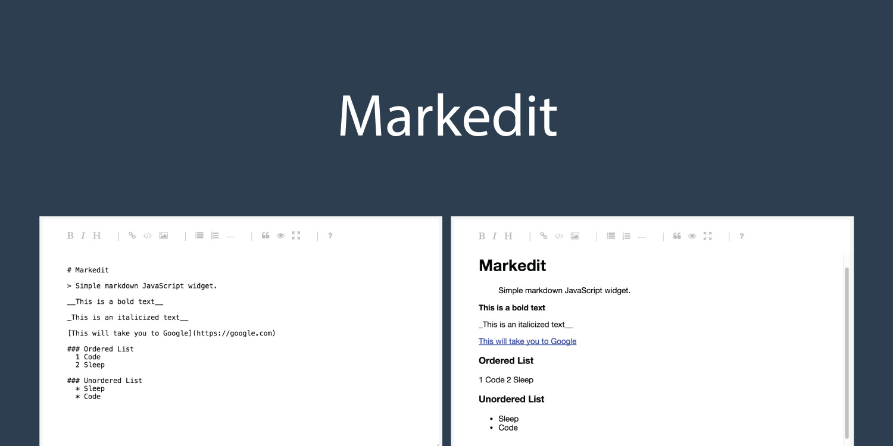

## Markedit
--------------------------

[](https://travis-ci.org/christiannwamba/markedit) [](https://www.npmjs.com/package/markedit) [](https://badge.fury.io/bo/markedit) [](https://codeclimate.com/github/christiannwamba/markedit) [](https://codeclimate.com/github/christiannwamba/markedit/coverage)

> Markedit is a simple JavaScript only markdown widget.



## Features

* __Small__ and __simple__
* Not __jQuery__ dependent
* Easy __Image__ upload
* Easy to __customize__
* Works with any browser above __IE9__


## Getting Started

* Add Markedit to your project using NPM or bower by running either of the following:

```bash
# NPM
npm install markedit

# Bower
bower install markedit
```
CDN coming soon

* Include Markedit to your code

```js
var Markedit = require('markedit');

var markedit = new Markedit(options);
```

Or

```html
<script src="dist/markedit.js"></script>
<script>
    var markedit = new Markedit(options);
</script>
```

Include the css file:
```html
<link rel="stylesheet" href="dist/markedit.css">
```

`markedit.css` references the font files which is available in the dist folder. If you plan to go custom, see [Custom Styles](https://github.com/christiannwamba/markedit#custom-style)

* Configure Options

```js
var options = {
            container: 'md',
            width: '400px',
            height: '400px',
            resize: 'both'
        };
```

* Load

```html
<div class="page_wrap">
    <div id="md"></div>
</div>
```

## Configuration

| Option        | Description   | Default  |
| ------------- |---------------| ------   |
| height     | Widget height | 400px    |
| width      | Widget width      |   400px    |
| imageUrl   | Endpoint for handling image upload    |   null    |
| marked | [Marked](https://github.com/chjj/marked)'s configuration  object   |    null    |
| markedHandler    | [Marked](https://github.com/chjj/marked)'s  callback    |   null    |
| resizeable     | Determines if widget should be resizeable or not (`both`, `horizontal`, `vertical`, `none`) | none    |

> Markedit uses [Marked](https://github.com/chjj/marked) to parse markdown. `options.marked` and `options.markedHandler` are passed as argument to Marked when parsing.

 ## Events

 You can also pass in some callbacks to the config to handle the events. Supported events are:

 * __onFocus__: Called when the editor has focus:

```js
var options = {
    onFocus: function(e) {
      console.log(e);
    }
};
```

 * __onBlur__: Called when the editor looses focus:

```js
var options = {
    onBlur: function(e) {
      console.log(e);
    }
};
```

* __onPreview__: Called when the preview button is clicked:

```js
var options = {
    onPreview: function(e) {
      console.log(e);
    }
};
```

* __onFullscreen__: Called when the full screen button is clicked:

```js
var options = {
    onFullscreen: function(e) {
      console.log(e);
    }
};
```

## Image Upload

Markedit supports image upload. To enable this feature, set the `imageUrl` to the url upload endpoint

```js
var options = {
    imageUrl: 'http://localhost:3000/images/upload'
}
```

The normal behavior of clicking the image button is to insert markdown image template at the cursor position but with image upload enabled, a file upload dialogue will be opened.

The end point provided should return a response that has an image property:

```js
{
    image: 'http://localhost:3000/uploads/just-uploaded.jpg'
}
```

An example handler using express and multer:

```js
// Imports
var express = require('express');
var bodyParser = require('body-parser');
var multer = require('multer');
var app = express();
var upload = multer({dest: 'uploads/'});

app.use('/uploads', express.static(path.join(__dirname, 'uploads')));
app.set('port', (process.env.PORT || 3000));

app.post('/api/image', upload.single('image'), function (req, res) {
          console.log(req.file);
          res.json({image: 'http://localhost:1337/'+req.file.path})
      });

app.listen(app.get('port'), function () {
            console.log(`Server started: http://localhost:${port}/`);
        });
```

## Custom Style

You can override the provided style. To do so, you need to understand the DOM hierachy.
Below is how the DOM looks under the hood:
```html
  <div class="markedit">
    <div class="markedit__controls">
      <a class="markedit__control bold">
        <i class="icon-bold"></i>
      </a>
      <a class="markedit__control header">
        <i class="icon-header"></i>
      </a>
      <a class="markedit__control italic">
        <i class="icon-italic"></i>
      </a>

     <!-- ... more icons but truncated for brevity -->
    </div>
    <textarea class="markedit__text">

    </textarea>
    <div class="markedit__preview">
      a
    </div>
  </div>
```
What you can then do is use the classes to target each item and add your custom style::

```css
.markedit__preview{
    background: black;
    color: white;
}
```

## Examples

See the examples folder in this repository for a working demo

## Contributing

1. Fork the repository
2. Clone to your workspace
3. Run `npm install`
4. Create a feature or bug fix branch
5. Make changes
6. Run `grunt` to:
    * Lint
    * Test
    * Build
7. Push and send in PR.

## Credits
[@chrizt_n](https://twitter.com/chrizt_n)
